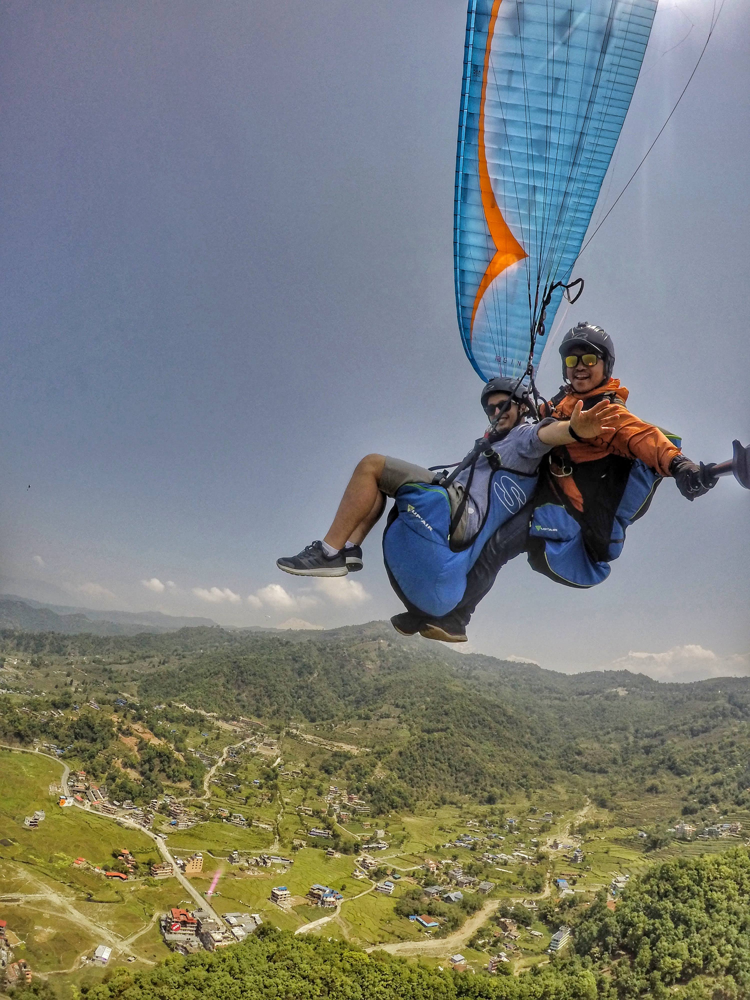

<h1 align="center">
Hi 👋... I'm Sajal!
</h1>

(He/Him/His)

## 🙂 About Me

My name is Sajal. The phonetic spelling of my name is **sa-jal**.

I completed my undergraduate in Bachelors in Information Management from Tribhuvan University(Nepal) in 2013. After my undergraduate, I worked for a couple of tech companies. My last employment was at Cotiviti Healthcare Analytics as a Senior Software Engineer. I worked there for five and half years, where my responsibilities were full stack software development and leading an agile team of 9 engineers. Previously, I also served as a DevOps engineer, where I learned things about automation, continuous integration and deployment, monitoring, configuration management, and cloud infrastructure.

## 🚵‍♀️ Something I enjoy

A few things I like to do are playing video games, watching SCI-FI movies, going on hikes, and cycling.

The picture below is me with my paragliding instructor flying through the landscape of Pokhara, Nepal, near Mt. Machapuchare, just before the COVID lockdowns hit Nepal. I chose this because, as someone who devotes most of my time sitting in a chair behind a laptop and monitor, paragliding gave a fantastic sensation of flying and the joy of complete freedom.

## 🧑🏻‍💻 What I'm Upto

I'm currently pursuing my master's in Data Science and Analytics. I choose this program due to my interest in Data engineering. Also, I'd like to understand and build complex data pipeline models with a lot of machine learning involved. That is why I hope to work as a Data Scientist and Machine Learning Engineer in a related field.

### 📌 STA 518

I took STA 518 to understand the basic and advanced concepts of R programming. As someone who wants to work in Data engineering, I believe R programming is a "golden standard" for statistical programming language in data science. Additionally, I think R programming is really loved in academics and industry. In my personal experience, I've seen that R programming is used to model complex data pipelines, perform data analysis, generate reports and design web applications for statistical visualizations. Still, I never had the chance to learn and apply it. I have very little knowledge in R programming, and I want to utilize this class to:

- Understand the basics of R syntax and data analysis.
- Ingest and organize data from different sources such as raw data(text, HTML) and structured data(SQL, spreadsheet, NoSQL).
- Perform statistical analysis and build statistical models.
- Able to perform different data visualization.
- Build web applications to create interactive dashboards.

## ❤️ My Inspirations

I love following people who inspire me to learn new things, share best practices and contribute to the open source community. Some of my favorite inspirations are (not in particular order):

- Python Guru and **Python Core Developer**, Raymond Hettinger (https://twitter.com/raymondh)

  Raymond is one of the few folks who inspired me to learn to code and expand my knowledge in Python programming. His [talks](https://www.youtube.com/results?search_query=raymond+hettinger) are insightful and very humurous.

- Creator of **VueJS** and Vite, Evan You (https://twitter.com/youyuxi)

  Evan is one of the most influential person in JavaScript community. He created [VueJs](https://vuejs.org/) while working for Google. He is also very active in Twitter and shares useful information on JavaScript and Web development in general.

- Creator of **FastAPI** Python framework, Sebastián Ramírez (https://twitter.com/tiangolo)

  Sebastian is the sole creator of FastAPI Python framework. I find its [documentation](https://fastapi.tiangolo.com/) to be the benchmark in terms of creating a well-documented code. The FastAPI framework is beloved by the community and has become the most loved framework within a few years of existence.

## 📓 Interesting facts about me

I love baking and cooking. In my free time, I used to bake cakes for my friends and family on special events and occasions.
